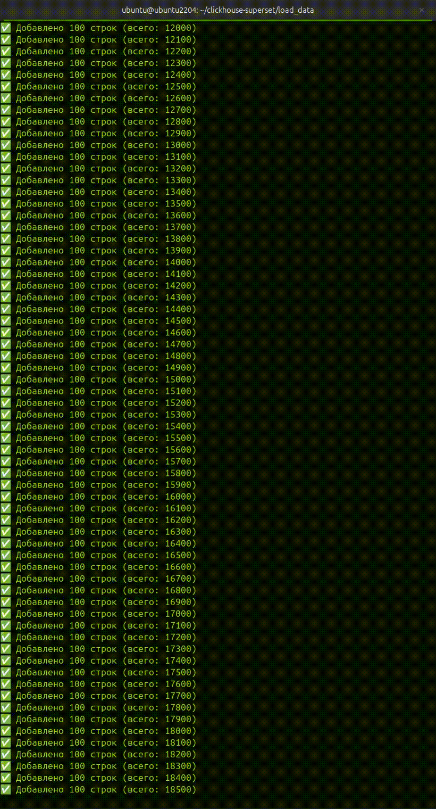
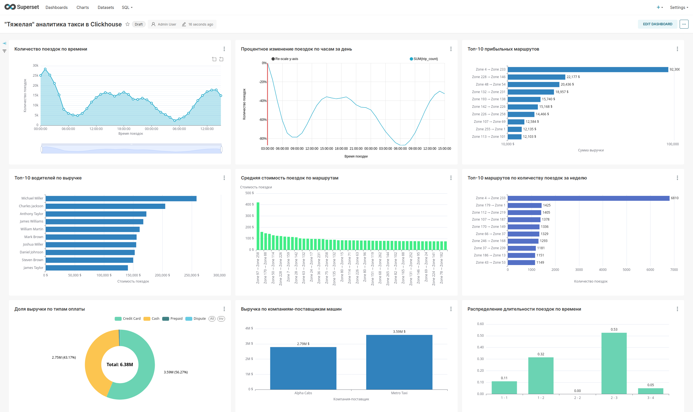

# NYC Taxi Trips — ClickHouse Analytics Project

Проект по анализу поездок такси в Нью-Йорке (данные за 2016 год) с использованием ClickHouse, материализованных представлений и Superset.


## 📚 Содержание

- [Структура проекта](#структура-проекта)
- [Установка и запуск](#установка-и-запуск)
  - [Установка ClickHouse](#1-установка-clickhouse)
  - [Подготовка окружения Python](#2-подготовка-окружения-python)
  - [Инициализация Superset](#3-первичная-инициализация-superset)
  - [Наполнение таблиц](#4-наполнение-таблицы-routes)
  - [Генерация и наполнение drivers](#5-генерация-и-наполнение-таблицы-drivers)
  - [Загрузка исторических данных](#6-наполнениие-таблицы-trips_raw-историческими-данными)
  - [Запуск стриминга](#7-запуск-стриминга-эмуляция)
  - [Скрытие всплывающих уведомлений](#8-опционально-в-дашборде)
- [Визуализация](#визуализация)
- [Особенности](#особенности)
- [Пример дашбордов](#пример-дашбордов)
- [Автор](#автор)

---
---

## 📁 Структура проекта

├── clickhouse-superset
│   ├── load_data
│   │   ├── convert_parquet_to_csv.py				 	# Скрипт конвертирующий файл с входными данными .parquet -> .csv
│   │   ├── generate_drivers.py								# Генерация таблицы водителей (drivers)
│   │   ├── generate_routes.py								# Генерация таблицы маршрутов (routes)
│   │   ├── load_trips.py											# Загрузка исторических данных поездок в ClickHouse
│   │   ├── stream_trips.py										# Имитация стриминга данных в ClickHouse (по 100 записей/сек)
│   │   └── yellow_tripdata_2016-01.parquet		# Файл с входными данными
│   ├── superset_config
│   │   └── superset_config.py								# Конфигурация Superset
│   ├── init_clickhouse_taxi_project.sql 			# SQL-скрипт: создание таблиц, представлений, MV в ClickHouse
│   └── requirements.txt											# Список зависимостей Python
├── config_dashboard
│   ├── dashboard_export_heavy.zip						# Кофнигурация "тяжелого" дашборда
│   └── dashboard_export_live.zip							# Кофнигурация "живого" дашборда
├── dbdiagram.io_shema
│   ├── shema_db.dbml													# Модель структуры БД в формате DBML
│   ├── shema_db.pdf													# Схема БД проекта в формате .pdf
│   └── shema_db.svg													# Схема БД проекта в формате .svg
├── img
│   ├── heavy_dashboard.png										# Скриншот "тяжелого" дашборда
│   ├── streaming_data.gif										# Анимационный скриншот потока данных
│   ├── live_dashboard.png										# Скриншот "живого" дашборда
│   └── streaming_update_dashboard.gif				# Анимационный скриншот "живого" дашборда
├── services
│   ├── clickhouse-server.service							# Конфигарация сервиса clickhouse-server в Ubuntu
│   └── superset.service											# Конфигарация сервиса superset в Ubuntu
├──verifycation_data
│		└── check_clickhouse_objects.sql					# SQL-скрипт: минимальная проверка данных в БД
└── README.md                                 # Документация или README


---

## ⚙️ Установка и запуск


### 1. Установка ClickHouse

Следуйте официальной инструкции: https://clickhouse.com/docs/en/getting-started/install
```bash
	curl https://clickhouse.com/ | sh
	sudo ./clickhouse install
```

=====================================================================================================================
P.S. Для загрузки исторических данных увеличил память до 8гб в config.xml:
```xml
	<max_memory_usage>8000000000</max_memory_usage>
```

*Опционально (для удобства создаем сервис, см. файл clickhouse-server.service):
Команды для использования однограктно после создания сервиса:
```bash
	sudo systemctl daemon-reexec # перезагрузит все файлы юнитов, а не конфигурацию systemd
	sudo systemctl daemon-reload # предписывает systemd перезагрузить и обновить свою внутреннюю конфигурацию
```
И команды включения, запуска, перезапуска и остановки:
```bash
	sudo systemctl enable clickhouse-server
	sudo systemctl start clickhouse-server
	sudo systemctl restart clickhouse-server
	sudo systemctl stop clickhouse-server
```


### 2. Подготовка окружения Python

```bash
	sudo apt update
	sudo apt install -y build-essential libssl-dev libffi-dev python3-dev python3-pip python3-venv libpq-dev libsasl2-dev

	python3 -m venv venv
	source venv/bin/activate
	pip install -r requirements.txt
```

P.S. Возможно кому-то мои шаги, могут быть полезны:
	
Дополнительные действия для установки (иногда были не доступны предыдущие версии пакетов):
```bash
	sudo nano /etc/resolv.conf
	nameserver 8.8.8.8
	nameserver 1.1.1.1
```

Для установки superset требуется Pyton и выяснилось, что необходимо использовать Python 3.10 (или 3.9 из исходников):
```bash
	sudo apt update
	sudo apt install -y wget build-essential libssl-dev zlib1g-dev \
			libncurses5-dev libncursesw5-dev libreadline-dev libsqlite3-dev \
			libgdbm-dev libdb5.3-dev libbz2-dev libexpat1-dev liblzma-dev tk-dev

	cd /usr/src
	sudo wget https://www.python.org/ftp/python/3.10.14/Python-3.10.14.tgz
	sudo tar xvf Python-3.10.14.tgz
	cd Python-3.10.14
	sudo ./configure --enable-optimizations
	sudo make -j$(nproc)
	sudo make altinstall
```

Создаём виртуальное окружение в домашнем каталоге (чтобы избежать ошибок с правами доступа):
```bash
	cd ~
	python3.10 -m venv superset-venv
	source superset-venv/bin/activate
```
Установка зависимостей:
```bash
	pip install --upgrade pip setuptools wheel
	pip install apache-superset
```


### 3. Первичная инициализация Superset:
Создаём superset_config.py:
```bash
	nano ~/superset_config.py
```
и генерируем для него ключ SECRET_KEY = "xXXXx", командой:
```bash		
	openssl rand -base64 42
```		
указываем Superset, где искать конфиг, для этого устанавливаем переменную окружения SUPERSET_CONFIG_PATH:
```bash		
	export SUPERSET_CONFIG_PATH=~/clickhouse-superset/superset_config.py
```

Далее возможно потребуется установить определенную версию marshmallow (библиотека для сериализации схем):
```bash		
	pip install marshmallow==3.19.0
```

Запускаем в виртуальном окружении:
```bash		
	superset fab create-admin \
		--username admin \
		--firstname Admin \
		--lastname User \
		--email admin@example.com \
		--password admin
```

Обновляем БД:
```bash		
	superset db upgrade
````		

Инициализируем приложение:
```bash		
	superset init
```

Для подключения к БД может потребоваться sqlalchemy-clickhouse:
```bash	
	pip install clickhouse-sqlalchemy
```

```bash	
	python3 -m venv venv 					# Создание виртуального окружения
	source venv/bin/activate			# Активация
	pip install requests 					# Установка зависимостей 
	pip install clickhouse-driver # Установка драйвера 
```

*Опционально (для удобства создаем сервис, см. файл superset.service):
Команды для использования однограктно после создания сервиса:
```bash	
	sudo systemctl daemon-reexec
	sudo systemctl daemon-reload
```	
	И команды включения, запуска, перезапуска и остановки:
```bash	
	sudo systemctl enable superset
	sudo systemctl start superset
	sudo systemctl restart superset
	sudo systemctl stop superset
```

	Содержимое `requirements.txt`:

```bash
	certifi==2025.4.26
	charset-normalizer==3.4.2
	idna==3.10
	requests==2.32.3
	urllib3==2.4.0
	clickhouse-driver>=0.2.6
	lz4
	clickhouse-cityhash
	pandas
	pyarrow
```

---

В результате Superset доступен по адресу:
```bash
	URL: http://localhost:8088/login/
	Логин: admin
	Пароль: admin
```

### 4. Наполнение таблицы routes:
Старый вид данных не получилось использовать, поэтому скачиваем файл БД такси (yellow_tripdata_2015-01.csv(1.99 GB)):
https://www.kaggle.com/datasets/elemento/nyc-yellow-taxi-trip-data?resource=download
	
У файла новый колоночный формат хранения данных - parquet - оптимизированный для хранения и чтения больших объемов таблиц. Используется в больших данных (Big Data), Apache Spark, Hadoop, ClickHouse, Pandas и др.
	
Для поддержки и работы с этим форматом нужно установить ещё зависимость:
```bash
	pip install pandas pyarrow
```

Сконвертировать его в csv скриптом convert_parquet_to_csv.py:
```bash
	import pandas as pd
	df = pd.read_parquet("yellow_tripdata_2016-01.parquet") # Загрузка Parquet-файла
	df.to_csv("yellow_tripdata_2016-01.csv", index=False)   # Сохранение в CSV
	print("✅ Конвертация завершена.")
```
В результате появится сконвериторованный файл yellow_tripdata_2016-01.csv в каталоге ~/clickhouse-superset/load_data.
Запускаем скрипт generate_routes.py 
	
### 5. Генерация и наполнение таблицы drivers:
```bash
	python3 generate_drivers.py
````

### 6. Наполнениие таблицы trips_raw историческими данными:
```bash
	python3 load_trips.py
```

### 7. Запуск стриминга (эмуляция). Перед запуском yellow_tripdata_2016-01.csv на месте:
```bash
	python3 stream_trips.py
```

### 8. Опционально: 
В дашборде можно добавить css-правило для скрытия всплывающих подсказках об авто обновлении:

Открыть дашборд → Edit dashboard → Edit CSS → LOAD A CSS TEMPLATE:
```css
	div[role="alert"] {
		display: none !important;
		visibility: hidden !important;
		height: 0 !important;
		margin: 0 !important;
		padding: 0 !important;
		overflow: hidden !important;
		pointer-events: none !important;
	}
```

### 9. Минимальная проверка наполненности БД:
```bash
	clickhouse-client < ~/clickhouse-superset/verifycation_data/check_clickhouse_objects.sql
```

---

## 📊 Визуализация

Используется **Superset 2.1+**. Все графики основаны на материализованных представлениях.

"Тяжелая" аналитика такси в Clickhouse (основана на исторических данных):
	- Количество поездок по времени
	- Процентное изменение поездок по часам за день
	- Топ-10 прибыльных маршрутов
	- Топ-10 водителей по выручке
	- Средняя стоимость поездок по маршрутам
	- Топ-10 маршрутов по количеству поездок за неделю
	- Доля выручки по типам оплаты
	- Выручка по компаниям-поставщикам машин
	- Распределение длительности поездок по времени

"Живая" аналитика такси в Clickhouse (за последние 15 минут):
	- Количество поездок по способу оплаты
	- Выручка по таксопаркам
	- Топ-10 маршрутов по среднему чеку
	- Топ-10 водителей по числу поездок
	- Распределение длительности поездок

---

## 📌 Особенности

- Используются агрегирующие и TTL MV
- Поддержка стриминга (данные поступают в таблицу по 100 строк в секунду)
- Все связи задокументированы в DBML

---


---

## 🔄 Обработка данных в реальном времени (Data Pipeline)

В проекте реализован полноценный **поток обработки данных (пайплайн)**, включающий:

1. **Источник данных** — `stream_trips.py` подаёт поездки с задержкой (эмуляция real-time).
2. **Хранилище событий** — `trips_raw` в ClickHouse.
3. **Агрегация в реальном времени** — материализованные представления с `TTL 15 минут`:
   - `revenue_by_vendor_last_15m`
   - `avg_fare_by_route_last_15m`
   - и другие
4. **BI-дашборды** — Superset строит визуализации прямо на этих live-представлениях.

📌 Это позволяет видеть обновления данных почти в реальном времени (каждые 1–2 секунды).

## 🖼️ Пример дашбордов




## 📎 Автор
Я :) — Fullstack-разработчик
